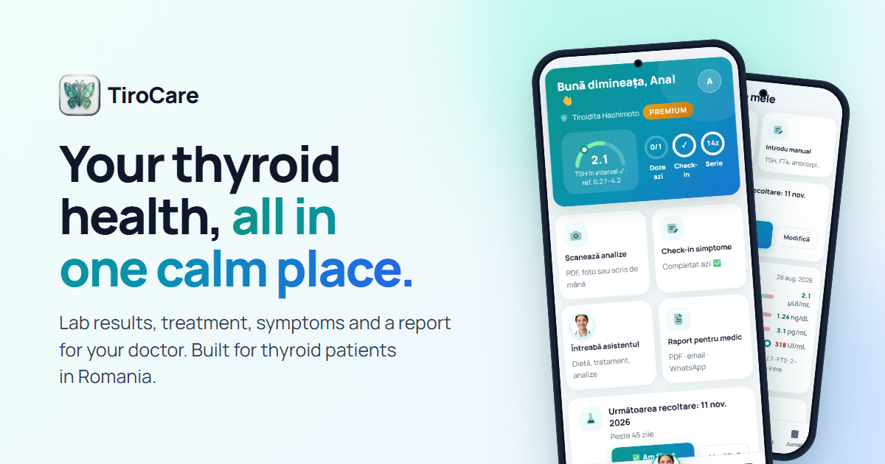

# TiroCare — website

The English-language presentation site for **TiroCare**, a personal companion app for people in Romania living
with thyroid conditions: lab results, treatment reminders, a symptom journal and a report for the doctor in one place.

**[Visit the site](https://tirocare-site.vercel.app)** · **[Open the web app](https://tirocareromania.netlify.app)** · [Case study](https://github.com/portalstudiodesign/tirocare-case-study)



> This repository contains the **website only**. TiroCare's app source is private because it is a commercial product.
> The app's interface is in Romanian; screenshots use a fictitious demo profile.

---

## What's on the page

| Section | What it shows |
|---|---|
| Hero | Value proposition, live web-app link, real app screens |
| Features | Lab import, pregnancy-aware ranges, reminders, journal, doctor report, assistant |
| Inside the app | Interactive screen switcher (accessible tabs, keyboard arrows) |
| How it works | Three steps and the 11 supported conditions |
| Safety & privacy | How a question passes the emergency check, dose guard and AI, plus data handling |
| Pricing | Free vs Premium with a monthly / yearly toggle |
| FAQ | Native `<details>` accordion |

## How it's built

- **Plain HTML, CSS and JavaScript.** No framework, no build step, about 1 MB in total including images.
- **No third-party requests.** The Manrope font is self-hosted; there are no trackers, analytics or CDNs.
- **Same design language as the app.** Colour, radius and motion tokens mirror the app's design system.
- **Built for perceived quality.** Fixed aspect ratios for every image (no layout shift), preloaded screens so
  tab switches are instant, and reveal animations that respect `prefers-reduced-motion`.
- **Accessible.** Semantic landmarks, skip link, visible focus states, ARIA tabs, and a mobile menu that closes on Escape.
- **Responsive** from 320 px phones to wide desktops, with no horizontal scrolling.
- **Hardened hosting.** `vercel.json` sets a strict Content Security Policy, security headers and asset caching.

```
index.html      all content
styles.css      design tokens and layout
main.js         header, mobile menu, screen tabs, pricing toggle, reveal on scroll
assets/fonts/   Manrope (SIL Open Font License)
assets/img/     app screens (WebP), logo, social preview
vercel.json     security headers and caching
```

## Run locally

```bash
python -m http.server 5182
```

Then open http://localhost:5182.

## Content rules

TiroCare is an information and tracking tool, not a medical device. Copy on this site never claims diagnosis,
dose recommendations or automatic scheduling of lab tests, never names specific laboratories, and always
carries the medical disclaimer. If the inline script in `index.html` changes, update its hash in the CSP in `vercel.json`.

---

Made by **Adrian Iulian Antal** · Portal Design Studio · [GitHub](https://github.com/portalstudiodesign) ·
[LinkedIn](https://www.linkedin.com/in/antal-adrian-iulian/)

© 2026. All rights reserved. The TiroCare name, logo and app screenshots may not be reused without permission.
